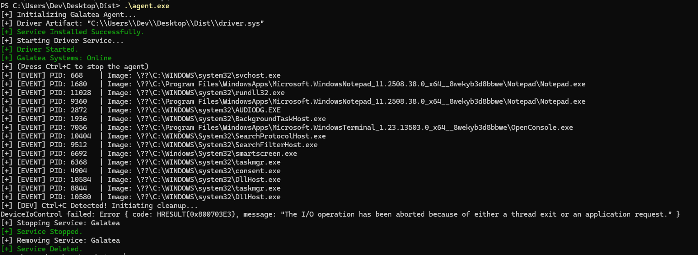

# Galatea Suite

> [!NOTE]
> This is a Rust rewrite of my dummy EDR "[Galatea EDR](https://github.com/Millitarychest/Galatea)", as i dislike working with c / c++.

### Description
The Galatea Suite is a very basic EDR written for Windows to gain a better understanding of EDR solutions and windows driver development.
This project was inspired by a [this post on sensepost.com](https://sensepost.com/blog/2024/sensecon-23-from-windows-drivers-to-an-almost-fully-working-edr/)


### How to run
> [!CAUTION]
> **!! NEVER RUN OUTSIDE OF A VM !!**\
> This is an experimental project written by someone that is an idiot
> Given that the EDR requires elevate permissions as well as a kernel driver, it can really screw up your PC or at the very least cause it to BSOD

Build the project by running the ```build.ps1``` script to run each project with the needed config. This will create the ```target/dist``` folder containing the files you need.
 
Follow the steps below to run the EDR. (Admin rights are required)
1. Setup your VM to allow self-signed drivers via ``bcdedit /set testsigning on`` ``bcdedit -debug on`` 
2. Start the agent by running ``Agent.exe``. This should automatically setup and start the driver aswell
3. (Optional) Currently to receive all output it is recommended to run ``Dbgview.exe`` and enable ``Capture Kernel``

To stop the EDR:
1. Stop the agent by pressing ```ctrl+c``` the agent will then run a few short clean ups and exit
2. (Optional) To fully disable and delete the current edr version remove the service using: ``sc.exe stop "Galatea Driver"`` and ``sc.exe delete "Galatea Driver"``


## Screenshots:
**Agent Output:**


### Prerequisites:
[cargo-make](https://github.com/sagiegurari/cargo-make) is required for building the driver

### Roadmap
__Stages:__
1. Endpoint 
    1. Logic
        - [x] Basic Driver Setup
        - [ ] Static checks
            - [ ] Known Bad
            - [ ] Signature
            - [ ] Heuristics (Packing)
        - [ ] ML based static detection
        - [ ] Dll based Userland hooks
        - [ ] Bilateral Health checks (Is Driver/agent alive?)
    2. Ui
        - [ ] Config screen 
    3. Hardening
        - [ ] Split Agent and restrict driver to Service Principal
2. Server
    1. Log gathering from Endpoint
### References
[\[1\] SensePost \| Sensecon 23: from windows drivers to an almost fully working edr](https://sensepost.com/blog/2024/sensecon-23-from-windows-drivers-to-an-almost-fully-working-edr/)