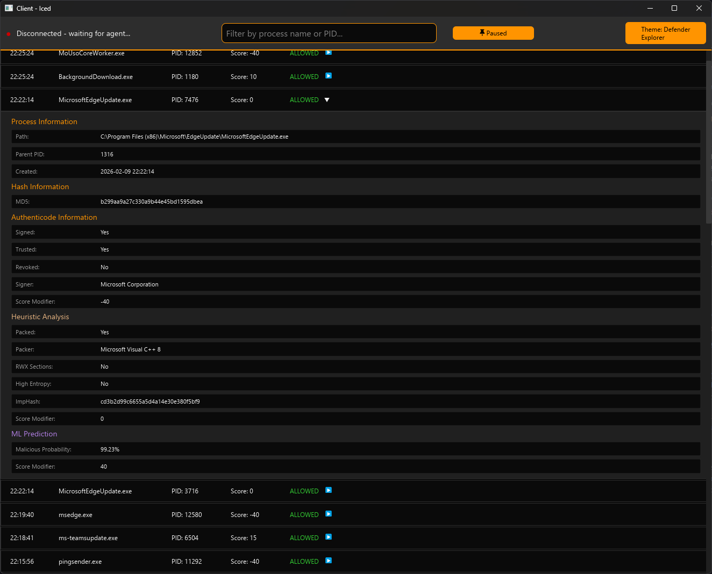

# Galatea Suite

> [!NOTE]
> This is a Rust rewrite of my dummy EDR "[Galatea EDR](https://github.com/Millitarychest/Galatea)", as I dislike working with c / c++.

### Description
The Galatea Suite is a very basic EDR written for Windows to gain a better understanding of EDR solutions and windows driver development.
This project was inspired by [this post on sensepost.com](https://sensepost.com/blog/2024/sensecon-23-from-windows-drivers-to-an-almost-fully-working-edr/)

A ``Known-Badlist`` can be provided as ``galatea_dataset.db`` in the agent directory for hash checks. If one is not provided the agent will initialize a empty list in the correct format on startup.

Under models scripts and a exported model for classification can be found. This was trained on a combination of [traceix data](https://huggingface.co/datasets/PerkinsFund/traceix-ai-security-telemetry/tree/main) and the [ember data](https://github.com/elastic/ember).

For a list of currently implemented features and what is planned check [``docs\roadmap.md``](docs/roadmap.md)

<br>

### How to run
> [!CAUTION]
> **!! NEVER RUN OUTSIDE OF A VM !!**\
> This is an experimental project written by an idiot
> Given that the EDR requires elevate permissions as well as a kernel driver, it can really screw up your PC or at the very least cause it to BSOD

Build the project and setup your VM via the instructions in [``docs\endpoint\SETUP.md``](docs/endpoint/setup.md)
 
Follow the steps below to run the EDR. (Admin rights are required)
1. Start the agent by running ``agent.exe``. This should automatically setup and start the driver aswell
2. Start the client by running ``client.exe`` to open the GUI and receive verdicts
3. (Optional) Currently to receive all output it is recommended to run ``Dbgview.exe`` and enable ``Capture Kernel`` to receive kernel output

To stop the EDR:
1. Stop the agent by pressing ```ctrl+c``` the agent will then run a few short clean ups and exit
2. (Optional) To fully disable and delete the current edr version remove the service using: ``sc.exe stop "Galatea Driver"`` and ``sc.exe delete "Galatea Driver"``


## Screenshots:
**Client GUI:**


**Agent Output:**


<br>

> [!NOTE]
> This projected was supported by Ai for the following parts:
> - Machine learning 
> - Gui


### Credits

- The IoCs used during development for the ``known bad`` list originate from [virusshare.com](https://virusshare.com/hashes).
- The Packer signatures in ``userdb.txt`` originate from [peid](https://github.com/packing-box/peid/blob/main/src/peid/db/userdb.txt), which themself credits: BobSoft, BobSoft_big, PEiDTab, ExeinfoPe, PEV and this [packing-box dataset](https://github.com/packing-box/dataset-packed-pe)

### References
[\[1\] SensePost \| Sensecon 23: from windows drivers to an almost fully working edr](https://sensepost.com/blog/2024/sensecon-23-from-windows-drivers-to-an-almost-fully-working-edr/)