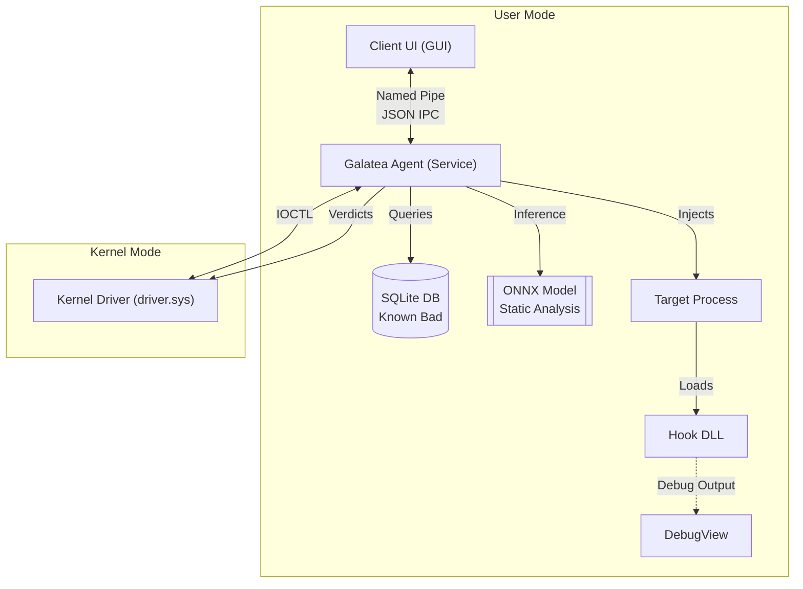

# Project Architecture

## System Overview

The Galatea EDR consists of three main components:

1.  **Agent (`agent.exe`)**: The core user-mode service that orchestrates detection. It handles:
    *   Communication with the kernel driver via IOCTL.
    *   Hosting the Named Pipe server for the UI.
    *   Performing static analysis
        *   Signature checks
        *   Authenticode checks
        *   Heuristics (Packing)
        *   ML inference
    *   Managing databases and configuration.
    *   Injecting the hook DLL into target processes.

2.  **Kernel Driver (`driver.sys`)**: A Windows kernel driver that:
    *   Registers Process Notify routines (`PsSetCreateProcessNotifyRoutineEx`).
    *   Intercepts process creation and termination.
    *   Freezes processes via APC until verdicts are received from the Agent.
    *   APC kills processes if verdict is "Bad".

3.  **Client UI (`client.exe`)**: A lightweight GUI built with `iced` that:
    *   Connects to the Agent via Named Pipe.
    *   Displays real-time alerts and process execution history.

4.  **Hook DLL (`hook.dll`)**: A user-mode DLL injected into target processes to:
    *   Hook sensitive APIs (e.g., `NtOpenProcess`, `NtAllocateVirtualMemory`) in the target's address space.
    *   (Currently) Output telemetry to debug streams.