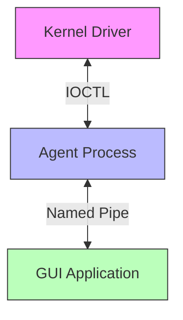

# IPC Protocol

## Overview

Galatea uses two distinct IPC channels:

1. **Driver <-> Agent:** IOCTL-based communication (kernel <-> user mode)
2. **Agent -> GUI:** Named pipe (user mode -> user mode)

 

## Communication Protocols

### Driver <-> Agent (IOCTL)

**IOCTL Codes:**

| Code | Value | Direction | Purpose |
|------|-------|-----------|---------|
| `IOCTL_GET_EVENT` | `0x80002000` | Agent → Driver | Poll for events |
| `IOCTL_SEND_VERDICT` | `0x80002004` | Agent → Driver | Submit verdict |
| `IOCTL_REGISTER_AGENT` | `0x80002008` | Agent → Driver | Register as agent |

**Polling Flow**

1. Agent sends `IOCTL_GET_EVENT` to driver
2. Driver **holds the IRP** (doesn't complete immediately)
3. When process creation occurs, driver:
   - Populates event data in IRP output buffer
   - Completes the IRP
4. Agent receives event and processes it
5. Agent immediately sends another `IOCTL_GET_EVENT` (polling loop)

### Agent -> GUI (Named Pipe)

**Pipe Name:** `\\.\pipe\galatea_ipc`
**Message Format:** JSON
**Message Types:**

| Type | Direction | Description |
|------|-----------|-------------|
| `ProcessEvent` | Agent → GUI | Process creation/termination event with verdict |
